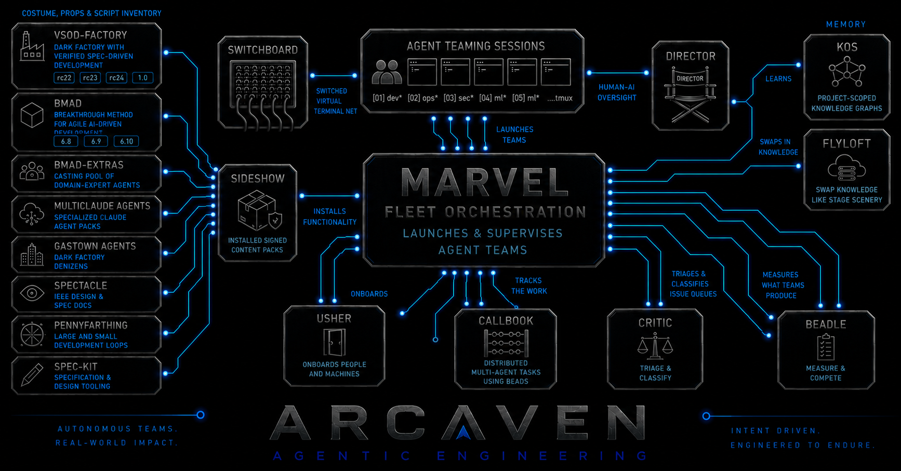

# Arcaven Agentic Engineering

> 🚧 **Pardon the construction — we're just getting started.** Some
> projects are useful today; others are designs or early builds. The tour
> below says which is which.

ArcavenAE follows the Unix philosophy: small, composable tools for
operating teams of AI agents. Each does one job, works on its own, and
connects through inspectable seams: files, command lines, tmux, and
signed artifacts. Use what you want.

## The tour

| Project | Function | State |
|---|---|---|
| [marvel](https://github.com/ArcavenAE/marvel) | Fleet orchestration for agent sessions: declarative teams, heartbeats, restart policies, shifts, and tmux runtime adapters. It can launch any console rather than requiring an Arcaven-specific agent. | usable, single-host |
| [kos](https://github.com/ArcavenAE/kos) | A lossless knowledge record for decisions, evidence, and ruled-out approaches, organized by confidence instead of flattened into one undifferentiated memory. | usable |
| [flyloft](https://github.com/ArcavenAE/flyloft) | Task-scoped retrieval across levels of detail. Automatic summaries remain linked to preserved source material, so a compact view never replaces the record. | skeleton |
| [switchboard](https://github.com/ArcavenAE/switchboard) | Remote access to any tmux session across hosts and NAT. SSH remains end to end; the relay routes sessions it cannot read. | protocol proven; rebuild in progress |
| [sideshow](https://github.com/ArcavenAE/sideshow) | Content-pack distribution for skills, commands, rules, and hooks. Packs can be built as frozen, signed compositions with traceable provenance. | usable, narrow; release verification in progress |
| [critic](https://github.com/ArcavenAE/critic) | A planned registry and arena for comparing agent-generated variants, preserving lineage and accounting for the cost of the selected outcome. | designed, pre-code |
| [beadle](https://github.com/ArcavenAE/beadle) | Issue and PR triage against a repository's declared intent, informed by what maintainers actually act on. | running today |
| usher | Onboarding and installation help for people and machines, with opt-in configuration and usage reporting. | design phase, private |
