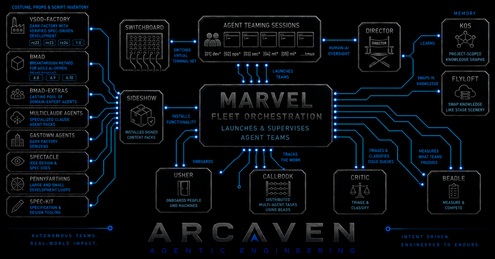

ArcavenAE follows the Unix philosophy: small, composable tools for
operating teams of AI agents. Each does one job, works on its own, and
connects through inspectable seams: files, command lines, tmux, and
signed artifacts. Use what you want.

> 🚧 **Pardon the construction. We're just getting started.** Some
> projects are useful today; others are designs or early builds. The tour
> below says which is which.

## The tour

| Project | Function | State |
|---|---|---|
| [marvel](https://github.com/ArcavenAE/marvel) | Fleet orchestration for agent sessions: declarative teams, heartbeats, restart policies, shifts, and tmux runtime adapters. It can launch any console rather than requiring an Arcaven-specific agent. | usable; alpha releases, named clusters |
| [kos](https://github.com/ArcavenAE/kos) | A lossless knowledge record for decisions, evidence, and ruled-out approaches, organized by confidence instead of flattened into one undifferentiated memory. | usable |
| [flyloft](https://github.com/ArcavenAE/flyloft) | Task-scoped retrieval across levels of detail. Automatic summaries remain linked to preserved source material, so a compact view never replaces the record. | skeleton |
| [switchboard](https://github.com/ArcavenAE/switchboard) | Remote access to any tmux session across hosts and NAT. SSH remains end to end; the relay routes sessions it cannot read. | protocol proven; rebuild in progress |
| [sideshow](https://github.com/ArcavenAE/sideshow) | Content-pack distribution for skills, commands, rules, and hooks. Packs can be built as frozen, signed compositions with traceable provenance. | usable, narrow; release verification in progress |
| [critic](https://github.com/ArcavenAE/critic) | A planned registry and arena for comparing agent-generated variants, preserving lineage and accounting for the cost of the selected outcome. | designed, pre-code |
| [beadle](https://github.com/ArcavenAE/beadle) | Issue and PR triage against a repository's declared intent, informed by what maintainers actually act on. | running today |

## Also public

| Project | Function | State |
|---|---|---|
| [director](https://github.com/ArcavenAE/director) | Supervisor communications for running work across many agent sessions, harnesses, and hosts. Today it is a skill a session plays by hand, plus a message bus probe (NATS) that carries its envelope between sessions. | simulation with a proven transport; the software is not built |
| [forestage](https://github.com/ArcavenAE/forestage) | An opinionated wrapper for Claude Code with persona theming, configurable defaults, and tmux session management. | usable; alpha releases |
| [tmux-cmc](https://github.com/ArcavenAE/tmux-cmc) | A Rust client for tmux control mode: one persistent connection, with responses and notifications routed by serial number. marvel and forestage use it. | usable; v0.1 crate |
| [callbook](https://github.com/ArcavenAE/callbook) | Work and task tracking for teams of people and agents, built on beads and Dolt, with deployment recipes from a laptop to a replicated service on Kubernetes. | usable; the agent-fleet mode is a design, not a drilled deployment |
| [sideshow-packs](https://github.com/ArcavenAE/sideshow-packs) | The publishing pipeline that builds signed, frozen sideshow packs (cosign keyless, with an SBOM), so users never execute untrusted build scripts. | MVP; first release `bmad-v6.3.0` |
| [sidestep](https://github.com/ArcavenAE/sidestep) | A Rust CLI for the StepSecurity API, generated from a vendored OpenAPI spec, with a local audit trail. | usable; alpha releases |
| [bloomctl](https://github.com/ArcavenAE/bloomctl) | The same pattern for the iru (formerly Kandji) endpoint management API: spec-driven, read-only by default, MCP-aware. | usable, pending live-tenant validation |
| [stave](https://github.com/ArcavenAE/stave) | An unofficial Rust CLI for the Wiz GraphQL API, read-only, with a local audit trail. Not affiliated with or endorsed by Wiz, Inc. | scaffold |
| [ThreeDoors](https://github.com/ArcavenAE/ThreeDoors) | A terminal task tool built on one idea: show three tasks, pick one, move forward. Built with Bubbletea, and used as an AI software factory experiment. | usable; alpha releases |
| [switchboard-blue](https://github.com/ArcavenAE/switchboard-blue) | An experimental copy of switchboard used for factory testing. | experimental; `v0.1.0-rc.1` |

Plumbing: [homebrew-tap](https://github.com/ArcavenAE/homebrew-tap) is the Homebrew tap for the tools above, and [renovate-config](https://github.com/ArcavenAE/renovate-config) is the shared Renovate preset.

## Forks for upstream contributions

These are forks kept to offer changes back upstream, not projects of the org's own: [beads](https://github.com/ArcavenAE/beads), [codex](https://github.com/ArcavenAE/codex), [scorecard](https://github.com/ArcavenAE/scorecard), [terraform-provider-stepsecurity](https://github.com/ArcavenAE/terraform-provider-stepsecurity), [jira-cli](https://github.com/ArcavenAE/jira-cli), [wirerust](https://github.com/ArcavenAE/wirerust), and [vsdd-factory](https://github.com/ArcavenAE/vsdd-factory) (external pull requests upstream only).
